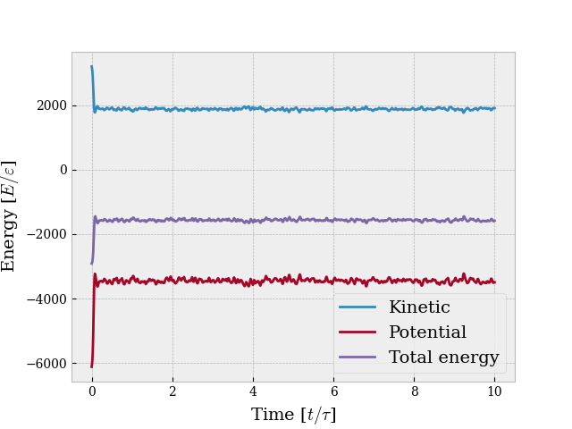
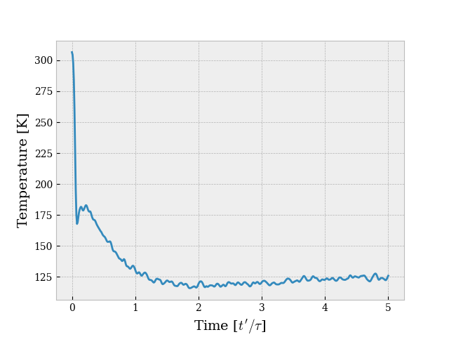

# 864 particles in a box
This example is about 864 particles in a box of length 12σ and periodic boundary conditions. The bulk is initialized in a face-centered crystal structure with length 10σ and initial temperature 300K. The Lennard-Jones potential and the Velocity-Verlet integrator are used.

The code can be found in ```simulation.py```, and looks like this:
``` python
from mdsolver import MDSolver
from mdsolver.potential import LennardJones
from mdsolver.integrator import VelocityVerlet
from mdsolver.initpositions import FCC
from mdsolver.initvelocities import Temperature
from mdsolver.boundaryconditions import Periodic

solver = MDSolver(positions=FCC(cells=6, lenbulk=10), 
                  velocities=Temperature(T=300),
                  boundaries=Periodic(lenbox=12),
                  T=5, 
                  dt=0.01)
solver(potential=LennardJones(solver, cutoff=3), 
       integrator=VelocityVerlet(solver),
       dumpfile="864N_3D.data")
solver.plot_energy()
solver.plot_temperature()
```
Ensure that ```mdsolver``` is installed before running the code.

## Results
As seen from the code above, the energy and temperature are plotted as a function of time. The plots are given below. 


