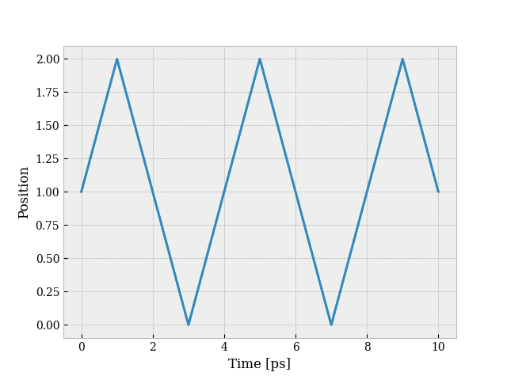

# One particle moving in two dimensions
This example is about one particle that is restricted to move in two dimension. The initial velocity is (1,1) and the particle starts at position (1,1). The Lennard-Jones potential and the Forward-Euler integrator are used. Reflective boundary conditions are chosen with a box length of 2σ with σ as the characteristic length of the Lennard-Jones potential. 

The code can be found in ```simulation.py```, and looks like this:
``` python
from mdsolver import MDSolver
from mdsolver.potential import LennardJones
from mdsolver.integrator import ForwardEuler
from mdsolver.initpositions import SetPositions
from mdsolver.initvelocities import SetVelocities
from mdsolver.boundaryconditions import Reflective

# Simulate two particles in one dimension separated by a distance 1.5 sigma
solver = MDSolver(positions=SetPositions([[1.0, 1.0]]), 
                  velocities=SetVelocities([[1.0, 1.0]]),
                  boundaries=Reflective(lenbox=2), 
                  T=10, 
                  dt=0.01)
solver(potential=LennardJones(solver), 
       integrator=ForwardEuler(solver),
       poteng=False)

# Plot the position as a function of time
from numpy import linspace
from matplotlib.pyplot import plot, show, xlabel, ylabel
r = solver.r.flatten()
plot(linspace(0,10,len(r)), r)
xlabel("Time [ps]")
ylabel("Position")
show()
```
Ensure that ```mdsolver``` is installed before running the code.

## Results
As seen from the code above, the particle position is plotted as a function of time. The plot is given below. 


We observe that the particle moves until it hits the wall at position 2σ, and is then reflected back.
